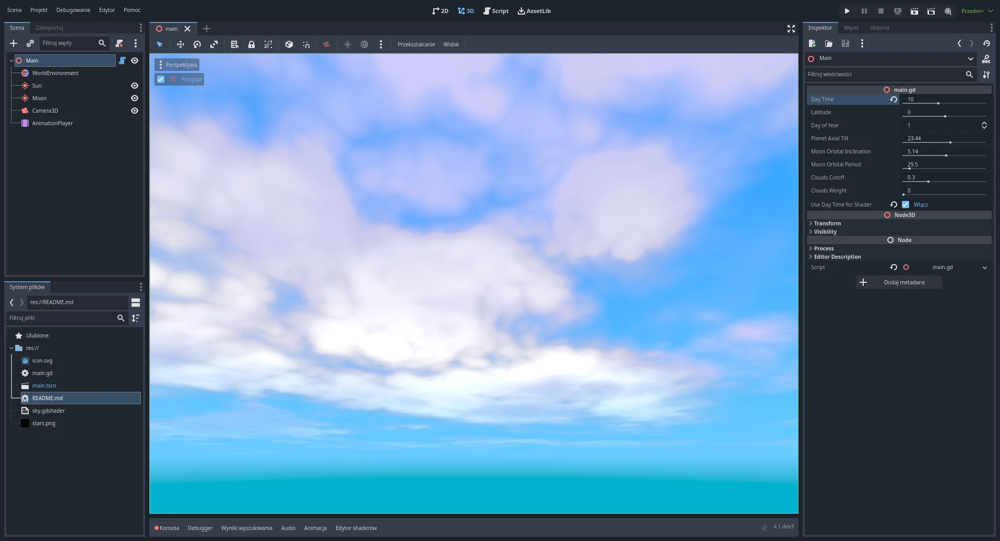
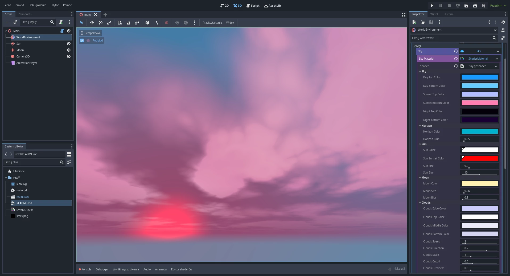
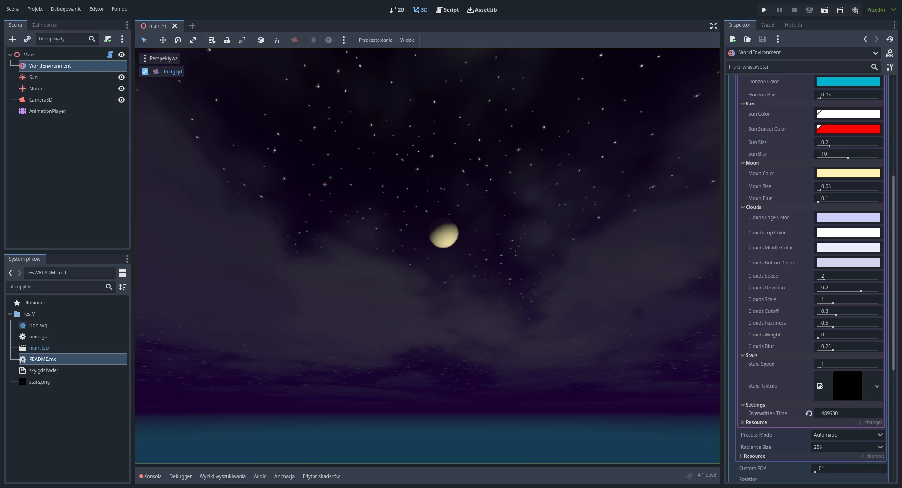

# godot-simple-sky-project

A simple Godot 4 project with day-night and season systems, a procedurally moving sun and moon, and a stylized sky shader.

Features:

- Extremely simplified day-night system with support for seasons based on latitude and earth axial tilt
	- Calculated position of the sun and drawing it through the sky shader
	- Shorter days in winter and longer in summer
	- Changing position of the sun depends of the day of the year
- Calculated position of the moon and drawing it through the sky shader
	- Include the inclination of the orbit and the period of time to cover it
- Sky shader
	- Clouds based on noise function (without repeating texture)
	- Phases of the moon depending on the position of the sun

Shader effect on YouTube:

